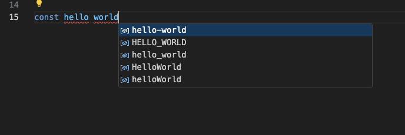

# var-conv-next

适用于 VSCode 的代码变量命名快速转换插件

## Features

1. 支持右键菜单切换变量命名风格
2. 支持快捷键方式切换变量命名风格
3. 支持输入时变量命名风格提示
4. 支持基于 SiliconCloud 变量命名风格转换 (实验, 目前极其不稳定)

## Usage

1. 右键选择 `变量命名转换(Next)` 切换命名风格

2. 快捷键换命名风格

    | case | win | mac | example |
    | --- | --- | --- | --- |
    | camel | alt+1 | alt+cmd+1 | helloWorld |
    | pascal | alt+2 | alt+cmd+2 | HelloWorld |
    | kebab | alt+3 | alt+cmd+3 | hello-world |
    | snake | alt+4 | alt+cmd+4 | hello_world |
    | constant | alt+5 | alt+cmd+5 | HELLO_WORLD |

3. 输入时提示

    

## License

[MIT](./LICENSE) License © 2023 [OSpoon](https://github.com/ospoon)
